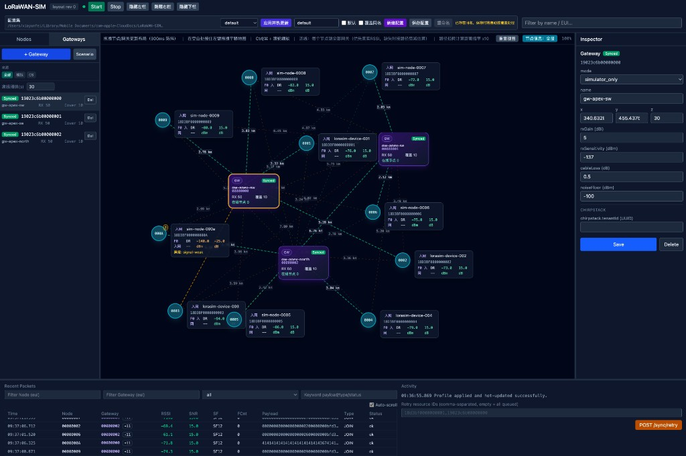

# LoRaWAN-SIM

**Languages:** [English](README.md) · [简体中文](README.zh-CN.md)

Open-source **LoRaWAN device and gateway simulator** (LoRaWAN 1.0.3) for integration testing, anomaly replay, and teaching. Optionally integrates **ChirpStack v4** (UDP / MQTT Gateway Bridge) and an optional **web console (`ui/`)** to orchestrate nodes and gateways.

**Runtime and npm dependencies live under [`simulator/`](simulator/)**: there is no `package.json` at the repository root—do **not** run `npm install` at the root to install the simulator.

### Web console (preview)

Optional **[`ui/`](ui/)** when the simulator **`controlServer`** is enabled: topology canvas (nodes ↔ gateways), side panels, Inspector, and recent packets / activity. Full doc index and the same screenshot context: [`docs/README.md`](docs/README.md).



---

## Capabilities (what this project can do)

Use this project to **emulate LoRaWAN end devices and gateways in software**, drive **real or simulated airtime** toward a **network server** (typically **ChirpStack v4**), and **observe or break** behavior on purpose—without physical radios.

### Core LoRaWAN simulation

- **LoRaWAN 1.0.x** device behavior: **OTAA** and **ABP**, Join Request / Join Accept, uplink data and downlink, **FCnt**, **MIC**, DevAddr, and common **MAC commands** (stack details in [`simulator/README.md`](simulator/README.md)).
- **Gateway path**: **Semtech UDP packet forwarder** and **MQTT Gateway Bridge**-style flows (publish/subscribe topics, JSON or Protobuf where configured) so traffic matches what ChirpStack expects.
- **Multi-device**: generate many devices from config or CSV, per-device uplink timing, optional **behavior templates**, confirmed uplinks, and scheduling options (interval, jitter, bursts).
- **Multi-gateway**: multiple gateway EUIs, placement, coverage modes, and gateway selection / load-style behavior (see [`simulator/README.md`](simulator/README.md)).

### RF and channel behavior (software model)

- **Path loss and environment**: e.g. Okumura–Hata / COST-231-style modeling, urban/suburban/indoor-style loss, **shadow** and **fast fading**, noise floor, and per-uplink **RSSI/SNR** suitable for testing ADR-like effects and dashboards.
- Optional **movement**, **environment zones**, and **derived anomalies** when enabled in config (`index.js` + runtime modules; see [`docs/PROJECT_ANALYSIS.md`](docs/PROJECT_ANALYSIS.md)).

### Anomaly injection (testing and demos)

- **18 named anomaly scenarios** (single source of truth in `anomaly_module.js`): protocol issues (e.g. FCnt, MIC, DevAddr), RF-like issues (signal, frequency, data rate), and behavior patterns (join and traffic). Use them to reproduce alarms, dropped joins, or bad payloads **deterministically**.
- Cross-reference: [`docs/DETECTION_RULES.md`](docs/DETECTION_RULES.md), [`docs/ANOMALY_RESPONSE.md`](docs/ANOMALY_RESPONSE.md), [`simulator/docs/异常行为模板参考.md`](simulator/docs/异常行为模板参考.md).

### Observability

- Continuous **`sim-state.json`** snapshot (schema in [`schemas/sim-state-v1.schema.json`](schemas/sim-state-v1.schema.json)): joins, nodes, gateways, counters, and error stats for scripts, CI, or the UI—**no UI required** to run the simulator.

### ChirpStack integration and operations

- Reference **Docker** stack under [`chirpstack-docker-multi-region-master/`](chirpstack-docker-multi-region-master/) to bring up ChirpStack and bridges locally.
- Root **CLI** [`scripts/lorasim-cli.mjs`](scripts/lorasim-cli.mjs): `validate`, `run`, and **`cs-*`** helpers to **check/apply gateways and OTAA devices** from JSON aligned with your `.env` (see [`.env.example`](.env.example)).
- Optional **live topology**: merge ChirpStack REST inventory with simulator state and MQTT **`rxInfo`** for a **realistic map** of node–gateway links in the UI (documented in [`docs/LORAWAN_SIM_CHIRPSTACK_UI_STATE_MACHINE.md`](docs/LORAWAN_SIM_CHIRPSTACK_UI_STATE_MACHINE.md)).
- **Dual-write orchestration** (feature-flagged): create/update nodes and gateways in the simulator and optionally in ChirpStack with retries and conflict handling (see `docs/` orchestration specs).

### Control-plane HTTP API and web UI

- When **`controlServer`** is enabled, JSON-configurable **HTTP APIs** including **`/resources/*`** (nodes/gateways/simulation), **`/layout/apply`**, **`/sync/retry`**, **`/config-profiles/*`**, and **`POST /chirpstack/refresh-inventory`** for topology refresh.
- Optional **[`ui/`](ui/)** (Vite + React): canvas, scenario editor, profile save/load, and sync status—see [`ui/README.md`](ui/README.md).

### Agents and automation

- **[`simulator/openclaw-lorawan-sim/`](simulator/openclaw-lorawan-sim/)** OpenClaw **plugin** exposing tools to agents (start/stop simulator, config, ChirpStack-oriented actions)—see [`docs/OPENCLAW_QUICKSTART.md`](docs/OPENCLAW_QUICKSTART.md).
- Optional **[`simulator/discord-bot/`](simulator/discord-bot/)** for chat-driven control.
- **`diagnose.js`** and inventory scripts under [`scripts/`](scripts/) for operational checks.

### Configuration and validation

- **Single JSON** model with **`extends` / presets**, validated against [`schemas/lorasim-config.schema.json`](schemas/lorasim-config.schema.json); field map in [`docs/CONFIG_MAP.md`](docs/CONFIG_MAP.md).

### What this project is not

- It does **not** replace **hardware RF certification** or regulatory measurements; it is a **protocol and LNS integration** simulator for **development, integration testing, teaching, and repeatable fault injection**.

---

## Prerequisites

- **Node.js**: ≥ 18 recommended (CI uses Node 20).
- **Install dependencies**
  - Simulator: `cd simulator && npm install`
  - Web console (optional): `cd ui && npm install`
- **ChirpStack / MQTT**: only needed for real LNS integration; pure local runs do not require them.
- **Environment tip**: avoid keeping the Git repo only under iCloud-synced “Desktop / Documents” (can break `.git` / `node_modules`); clone to a non-synced path (e.g. `~/Developer/`).

---

## Repository map

| Path | Purpose |
|------|---------|
| [`simulator/`](simulator/) | Main entry: `index.js`; default config `config.json`; writes local `sim-state.json` at runtime (not committed; see `.gitignore`) |
| [`simulator/start.sh`](simulator/start.sh) | Simulator core only (background + `.run-sim.log`, no frontend) |
| [`scripts/`](scripts/) | Unified CLI [`lorasim-cli.mjs`](scripts/lorasim-cli.mjs), config validation, ChirpStack gateway/device helpers |
| [`ui/`](ui/) | Web console (Vite + React); talks to the simulator control-plane HTTP API |
| [`chirpstack-docker-multi-region-master/`](chirpstack-docker-multi-region-master/) | Reference multi-region ChirpStack Docker stack |
| [`docs/`](docs/) | Top-level doc index, runbooks, quick references |
| [`schemas/`](schemas/) | JSON Schema for `lorasim-config` and `sim-state` |
| [`simulator/docs/`](simulator/docs/) | Simulator docs in Chinese |

Example JSON and [`.env.example`](.env.example) use **placeholder** IPs, ports, and UUIDs—replace them with your environment and ChirpStack console values.

---

## Quick start (pick one path)

### A. Simulator only (no LNS)

From the **repository root** (recommended for consistent commands):

```bash
cd simulator && npm install && cd ..
node scripts/lorasim-cli.mjs help
node scripts/lorasim-cli.mjs validate -c simulator/configs/example-extends-chirpstack.json -p multigw
node scripts/lorasim-cli.mjs run -c simulator/configs/example-extends-chirpstack.json
```

Smaller single-gateway UDP preset: [`simulator/configs/presets/minimal-otaa-udp.json`](simulator/configs/presets/minimal-otaa-udp.json).

Or start from inside `simulator/`:

```bash
cd simulator
npm install
node index.js -c configs/example-extends-chirpstack.json
# or: ./start.sh configs/example-extends-chirpstack.json
```

`node main.js` is **deprecated** (forwards to `index.js`); prefer `index.js` or `lorasim-cli.mjs run` from the root.

### B. ChirpStack integration

1. **Start the stack**: follow [`chirpstack-docker-multi-region-master/README.md`](chirpstack-docker-multi-region-master/README.md) for ChirpStack and Gateway Bridge.
2. **Align networking**: `lnsHost`, `lnsPort` (or MQTT fields) must match a reachable Gateway Bridge address.
3. **API credentials**: copy root [`.env.example`](.env.example) to `.env` and set `CHIRPSTACK_API_URL`, `CHIRPSTACK_API_TOKEN`, `CHIRPSTACK_APPLICATION_ID`, `CHIRPSTACK_DEVICE_PROFILE_ID`, etc.
4. **Optional**: register gateways/devices via root CLI or lower-level scripts.

Root CLI examples (replace `-c` with your config):

```bash
node scripts/lorasim-cli.mjs cs-gw-check  -c simulator/configs/example-extends-chirpstack.json --env-file .env
node scripts/lorasim-cli.mjs cs-gw-apply  -c simulator/configs/example-extends-chirpstack.json --env-file .env
node scripts/lorasim-cli.mjs cs-dev-dry   -c simulator/configs/example-extends-chirpstack.json --env-file .env
node scripts/lorasim-cli.mjs cs-dev-apply -c simulator/configs/example-extends-chirpstack.json --env-file .env
```

See also [`scripts/chirpstack-ensure-gateways-from-config.mjs`](scripts/chirpstack-ensure-gateways-from-config.mjs) and [`scripts/chirpstack-provision-otaa-from-config.mjs`](scripts/chirpstack-provision-otaa-from-config.mjs) (details and risks in [`simulator/README.md`](simulator/README.md)).

**Step-by-step** (config → validate → ChirpStack → run): section “使用手册” in [`simulator/README.md`](simulator/README.md); runbook: [`docs/LORAWAN_SIM_CHIRPSTACK_INTEGRATION_RUNBOOK.md`](docs/LORAWAN_SIM_CHIRPSTACK_INTEGRATION_RUNBOOK.md).

### C. Web console (optional)

1. Enable the control plane in the simulator JSON, e.g. `controlServer.enabled: true`, `controlServer.port` (default `9999`).
2. Orchestration features depend on env vars (see [`.env.example`](.env.example)): e.g. `ENABLE_ORCHESTRATOR_API`, `ENABLE_CHIRPSTACK_SYNC`, etc.
3. With the simulator running, in another terminal:

```bash
cd ui
npm install
npm run dev
```

Recommended for local development: restart simulator + UI together from repo root:

```bash
./scripts/restart-dev-services.sh
```

Vite proxies API calls to `VITE_CONTROL_PROXY_TARGET` (default `http://127.0.0.1:9999`). See [`ui/README.md`](ui/README.md).

**ChirpStack live topology (optional)**: with `chirpstack.topologyEnabled: true` (or `ENABLE_CHIRPSTACK_TOPOLOGY=true`) and a REST API token, the control plane merges ChirpStack devices/gateways into `GET /sim-state` and draws node–gateway edges using MQTT integration `rxInfo`. Use the **Scenario** panel and **Refresh** in the UI; see [`simulator/docs/使用指南.md`](simulator/docs/使用指南.md) §5.1 and [`docs/LORAWAN_SIM_CHIRPSTACK_UI_STATE_MACHINE.md`](docs/LORAWAN_SIM_CHIRPSTACK_UI_STATE_MACHINE.md).

**UDP alignment tips (UI)**: in **Scenario**, you can select UDP protocol (`udp4/udp6`) and UDP target port (stored as `lnsPort` / `simulation.gateway.port`). When you change `chirpstack.baseUrl`, the UI auto-derives its host and aligns it to UDP forwarding target (`lnsHost` / `simulation.gateway.address`). Note: changing `udp.protocol` requires restarting the simulator; changing port/host is usually hot-updatable.

### D. OpenClaw Agent / Discord (optional)

- **OpenClaw plugin (recommended)**: [`simulator/openclaw-lorawan-sim/`](simulator/openclaw-lorawan-sim/) · quick start [`docs/OPENCLAW_QUICKSTART.md`](docs/OPENCLAW_QUICKSTART.md)
- **Discord bot**: [`simulator/discord-bot/README.md`](simulator/discord-bot/README.md)

---

## After startup

- **State snapshot**: `simulator/sim-state.json` is updated continuously (not committed by default; see [`simulator/.gitignore`](simulator/.gitignore)). Inspect `joined`, nodes, `stats.uplinks` / `stats.errors` (contract: [`schemas/sim-state-v1.schema.json`](schemas/sim-state-v1.schema.json)).
- **Logs**: [`simulator/start.sh`](simulator/start.sh) writes to `simulator/.run-sim.log`; `node index.js` logs to the terminal.

---

## Configuration and validation

- **Validate before run**: `node scripts/lorasim-cli.mjs validate -c <config.json> [-p v20-udp|multigw|mqtt|openclaw]` (default `v20-udp`)
- **Field reference and `extends` / `preset`**: [`docs/CONFIG_MAP.md`](docs/CONFIG_MAP.md)
- **JSON Schema**: [`schemas/lorasim-config.schema.json`](schemas/lorasim-config.schema.json)
- **Chinese integration overview**: [`simulator/docs/配置与联调总览.md`](simulator/docs/配置与联调总览.md)

---

## Further reading

| Doc | Description |
|-----|-------------|
| [`simulator/README.md`](simulator/README.md) | Full simulator guide, anomaly list, ChirpStack flows |
| [`simulator/docs/README.md`](simulator/docs/README.md) | Simulator doc index |
| [`docs/README.md`](docs/README.md) | Repo-wide index (UI contracts, release governance) |
| [`PROJECT.md`](PROJECT.md) | Roadmap, milestones, layout, Agent integration |

---

## Status and releases

UI v1 and orchestration APIs (`/resources/*`, `/layout/apply`, `/sync/retry`, `/config-profiles/*`) are implemented; ChirpStack topology also exposes `POST /chirpstack/refresh-inventory` (see [`ui/README.md`](ui/README.md)). Release governance and preflight live under `docs/`. Milestones: [`PROJECT.md`](PROJECT.md).

---

## Git and CI

- **Default branch**: `main` (CI also applies to `master` if present).
- **CI**: [`.github/workflows/ci.yml`](.github/workflows/ci.yml) runs on **push** and **pull_request** to `main` / `master`: `node --check` on key files, `scripts/ci-module-smoke.js`, `scripts/ci-openclaw-resolve-smoke.mjs`, `simulator` `npm test`, and `ui` `npm ci` + `npm run build`.
- **Ignores**: root [`.gitignore`](.gitignore) excludes `.env`, `.cursor/`, `memory/`, `.openclaw/`, etc.—do not commit secrets or tokens.

## Pre-push checklist (recommended)

From the repository root:

```bash
node scripts/ci-module-smoke.js
node scripts/ci-openclaw-resolve-smoke.mjs
cd ui && npm run build
cd ../simulator && npm test
```

Before committing: ensure `.env` and tokens are not tracked; the demo path (`simulator/index.js`, optional `ui`, `sim-state` output) should be reproducible.

---

## License

MIT
