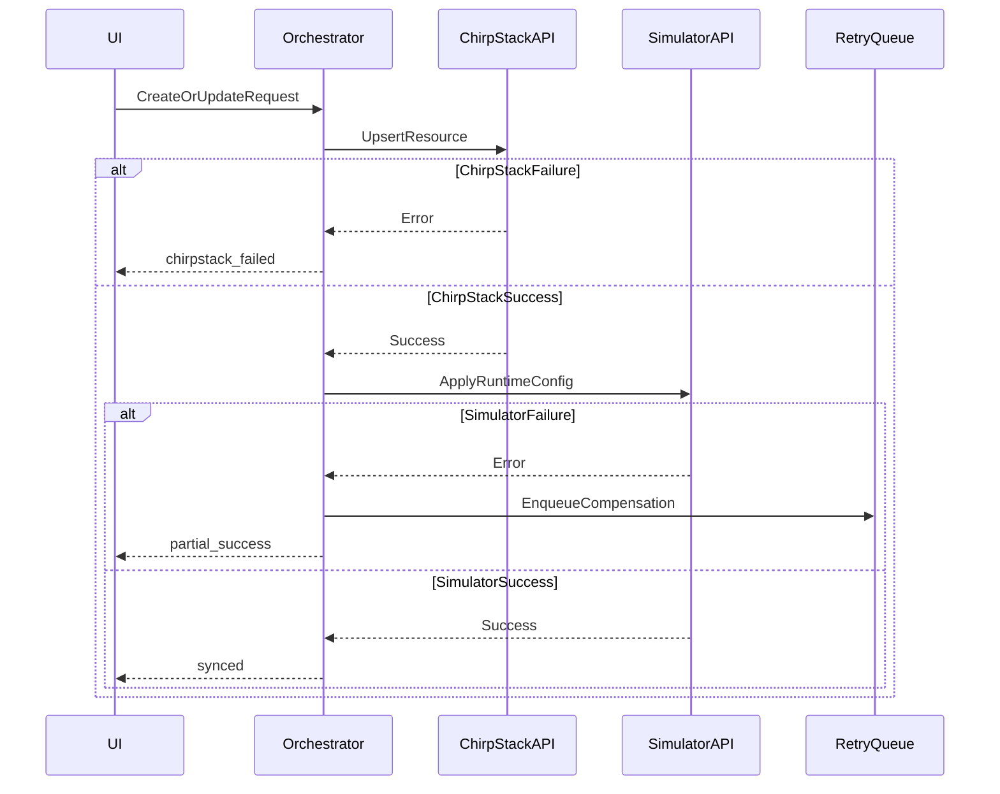

# LoRaWAN-SIM x ChirpStack Orchestration Design

## Goal

Define the write orchestration workflow to keep UI, ChirpStack, and simulator consistent for create/update/delete/layout operations.

## Write Strategy

Default strategy: `chirpstack_first`.

- If ChirpStack fails, stop and return error.
- If ChirpStack succeeds but simulator fails, return `partial_success` and enqueue retry.
- If both succeed, return `synced`.

Optional strategy: `simulator_only` (for local test scenarios).

## Sequence Diagram



## Operation Policies

### Create Node

1. Validate payload and uniqueness (`devEui`).
2. Create ChirpStack device and keys.
3. Add node into simulator config/runtime.
4. Emit sync status event.

### Update Node

1. Read current resource version.
2. Apply ChirpStack mutable fields.
3. Apply simulator runtime and layout fields.
4. Persist operation journal.

### Delete Node

Modes:

- `simulator_only`: disable/remove from simulator only.
- `both`: remove from simulator and ChirpStack device.

### Create/Update/Delete Gateway

Same orchestration as node with `gateway_id` key.

### Layout Apply

- Validate `revision` and each item kind.
- Apply simulator coordinates in one batch.
- No ChirpStack update needed for layout-only change by default.
- If gateway geolocation sync is enabled, push metadata update to ChirpStack async.

## Idempotency Design

Each mutating API requires an idempotency key:

- Header: `Idempotency-Key`
- TTL: 24h
- Dedup key: `method + path + hash(body) + key`

Behavior:

- first request: execute and store result
- duplicate request: return stored result and original status

## Compensation and Retry

Retry queue schema:

```json
{
  "jobId": "sync-job-0001",
  "resourceId": "18d3bf0000000001",
  "operation": "update_node",
  "stageFailed": "simulator_apply",
  "attempt": 2,
  "maxAttempts": 8,
  "nextRunAt": "2026-03-26T15:30:00.000Z"
}
```

Retry policy:

- exponential backoff: `5s, 15s, 60s, 5m, 15m`
- stop at max attempts and mark `error`
- support manual retry via `/sync/retry`

## Drift Detection

Drift means orchestrator state differs from any target.

Detection triggers:

- scheduled reconciliation
- explicit `/sync/reconcile`
- operation-time read mismatch

Resolution actions:

- `pull_from_chirpstack`
- `push_to_targets`
- `manual_review_required`

## Audit and Traceability

Every write operation logs:

- `correlationId`
- actor (`ui-user` or `system`)
- before/after snapshots (redacted for secrets)
- target call results and response codes

Minimum log sinks:

- application log
- append-only operation journal

## Existing Script Reuse Plan

- gateway upsert logic can wrap `scripts/chirpstack-ensure-gateways-from-config.mjs` behavior.
- device upsert/key behavior can wrap `scripts/chirpstack-provision-otaa-from-config.mjs` logic.
- simulator run/control remains based on `simulator/index.js` and control endpoint `127.0.0.1:9999`.
