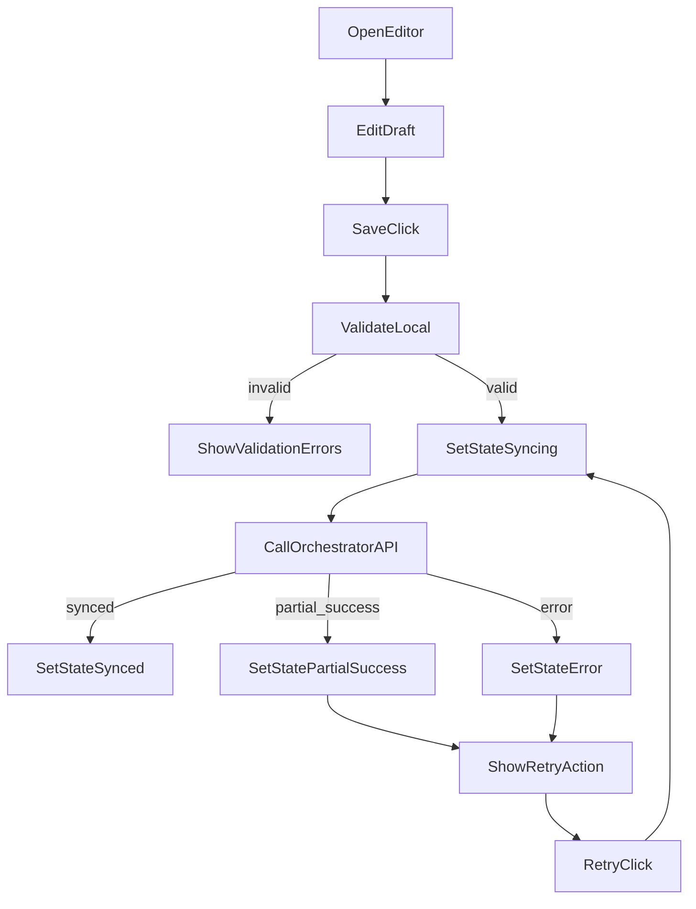
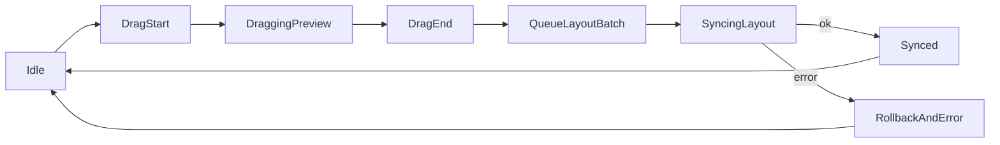

# LoRaWAN-SIM UI State Machine

## Scope

This document defines UI behavior for:

- add/edit node and gateway
- drag and drop layout
- sync badges and conflict prompts

## Global UI Sync State

Per resource state:

- `local_dirty`
- `syncing`
- `synced`
- `error`
- `partial_success`

Badge mapping:

- `local_dirty`: gray dot + text `Pending`
- `syncing`: blue spinner + text `Syncing`
- `synced`: green check + text `Synced`
- `partial_success`: orange warning + text `PartiallySynced`
- `error`: red warning + text `SyncFailed`

## Page Partition Wireframe v1

Global shell:

- `TopBar`: workspace title, global search, aggregate sync indicator, quick actions
- `LeftPanel`: Nodes/Gateways list, filters, add actions
- `Canvas`: topology and drag interactions
- `RightPanel`: contextual editor for selected node/gateway
- `BottomPanel`: sync/log timeline and retry feedback

Layout conventions:

- list and filter actions stay in `LeftPanel`
- create/edit/save/retry actions stay in `RightPanel`
- drag operations happen only in `Canvas`
- batch apply and global sync feedback are exposed in `TopBar` and `BottomPanel`

## Key User Flows v1

### Add Node

1. User clicks `AddNode` from `LeftPanel`.
2. `RightPanel` opens node form draft with state `local_dirty`.
3. On save:
   - set badge to `syncing`
   - call `POST /resources/nodes`
4. API result:
   - success -> `synced`
   - retryable error -> `error` + keep retry CTA visible
   - partial target success -> `partial_success` + non-blocking toast

### Add Gateway

1. User clicks `AddGateway` from `LeftPanel`.
2. `RightPanel` opens gateway form draft with `local_dirty`.
3. On save:
   - set badge to `syncing`
   - call `POST /resources/gateways`
4. API result uses the same badge transition rule as node add flow.

### Edit Node/Gateway

1. User selects resource in `LeftPanel` or `Canvas`.
2. `RightPanel` loads current snapshot and enters draft mode on first change.
3. Save calls:
   - node -> `PATCH /resources/nodes/{devEui}`
   - gateway -> `PATCH /resources/gateways/{gatewayId}`
4. Keep save disabled while state is `syncing`.

### Drag And Apply

1. Drag updates local preview only.
2. Drag end queues a single debounced batch (300ms).
3. Submit one `POST /layout/apply` request for all moved items.
4. On success set moved resources to `synced`; on error set `error` and offer retry path.

## Node/Gateway Editor Flow

## Drag and Drop Flow

### Interaction Rules

- drag start: keep server untouched, update local ghost position
- drag move: realtime canvas redraw (links and heatmap preview)
- drag end: debounce 300ms and submit one batch `/layout/apply`

### State Flow

## Conflict and Drift UX

Conflict trigger examples:

- revision mismatch (`conflict_revision`)
- resource changed externally in ChirpStack

UI prompt options:

- `OverwriteRemote` (push local state)
- `ReloadRemote` (discard local draft)
- `CompareAndMerge` (manual merge dialog)

Default recommendation:

- layout conflict -> `ReloadRemote`
- parameter conflict -> `CompareAndMerge`

## Form Sections

### Node Form

- identity: `name`, `devEui`, `activation`
- radio: `sf`, `bw`, `frequency`, `txPower`, `intervalMs`, `adr`
- placement: `x`, `y`, `z`
- ChirpStack binding: `tenantId`, `applicationId`, `deviceProfileId`

### Gateway Form

- identity: `name`, `gatewayId`
- radio: `rxGain`, `rxSensitivity`, `cableLoss`
- placement: `x`, `y`, `z`
- ChirpStack binding: `tenantId`

## UX Guardrails

- disable save button during `syncing`
- require confirm before delete with `scope=both`
- show non-blocking toast for `partial_success`
- keep retry CTA visible in side panel until resolved

## Event Subscriptions for UI Refresh

UI should subscribe and reconcile on:

- `simulator/status`
- `simulator/node/{devEUI}/join`
- `simulator/node/{devEUI}/adr`
- `simulator/node/{devEUI}/mac`
- `simulator/gateway/{gwID}/rx`
- `simulator/layout/updated` (new orchestrator topic/event)
- `simulator/sync/status` (new orchestrator topic/event)

## ChirpStack 真实拓扑（清单 + MQTT rxInfo）

当在配置中启用 `chirpstack.topologyEnabled: true` 或环境变量 `ENABLE_CHIRPSTACK_TOPOLOGY=true` 时，控制面会：

- 周期性用 ChirpStack REST 拉取应用下设备与租户下网关，合并进 `GET /sim-state` 的 `nodes` / `gateways`，并设置 `source: chirpstack`（与模拟器节点并列；同 DevEUI 时以模拟器为准）。
- 在 **MQTT 模式**下复用已有订阅 `application/+/device/+/event/up`，从 JSON 的 `rxInfo` 更新 `gatewayReceptions`（节流约 600ms/设备）。**UDP 模式**下可配置 `chirpstack.integrationMqtt` 单独连接 Broker 订阅同一类主题。
- 将仅属于 ChirpStack 的实体画布坐标写入 `sim-state.json` 的 `topologyOverlay`；`POST /layout/apply` 对这些 EUI 只更新 overlay，不写 `config.devices`。

### Inspector 与删除

- `source === chirpstack` 的节点/网关在 UI 中为 **只读**：不提供删除到 ChirpStack 的入口；左侧列表不显示 Del（在 ChirpStack 控制台管理）。
- 同步徽章对 CS 导入实体不表示「待同步到 CS」，仅模拟器创建的资源沿用原有 sync 语义。

### Web UI 入口（与配置对应）

| 区域 | 行为 |
|------|------|
| **Scenario** | `PATCH /resources/simulation` 的 `simulation.chirpstack` 中可编辑 `topologyEnabled`、`inventoryPollSec`、`rxStalenessSec`、`applicationIds`、`integrationMqtt` 等；保存后持久化到模拟器配置。 |
| **顶栏** | `topologyDisplayEnabled` 为真时显示 **CS 拓扑** 标签。 |
| **左栏** | **来源** 筛选全部 / 模拟器 / ChirpStack；拓扑启用时显示 **ChirpStack 清单** 统计与错误，**刷新** 触发 `POST /chirpstack/refresh-inventory`。 |
| **Inspector** | CS 节点/网关为只读说明；CS 节点可展示 `gatewayReceptions`（来自 MQTT `rxInfo`）。 |
| **画布** | CS 实体使用区别于模拟器的样式（teal）；拖拽仍走 `POST /layout/apply`（CS-only 坐标进 `topologyOverlay`）。 |
