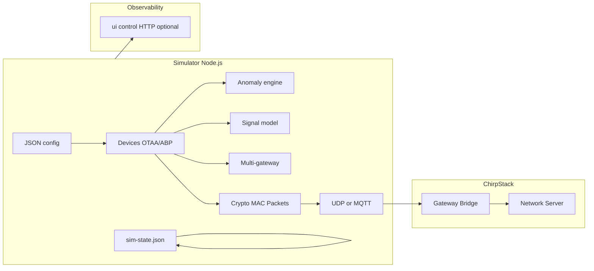

# LoRaWAN-SIM 全项目分析

> 本文档落实仓库架构说明与深化项：sim-state 更新路径对照、异常场景与代码映射、可选运动/环境/衍生异常（`motion-environment.js`）与主线关系。  
> 与 [PROJECT.md](../PROJECT.md) 路线图互补，不作重复替换。

## 1. 仓库定位与目标

- **核心产品**：开源 **LoRaWAN 网关模拟器**（节点 + 网关侧报文），协议目标为 **LoRaWAN 1.0.3**，对接 **ChirpStack v4**（UDP 或 MQTT Gateway Bridge）。
- **主要用途**：网络测试、异常注入复现、教学；PROJECT.md 将模块完成度标为 v1.0 候选，调试状态约 80%、文档约 80%。
- **用户画像**：运维、物联网开发者、协议学习者；常见环境为 AS923、远程 ChirpStack（见 USER.md）。

## 2. 目录与职责（高层）

| 区域 | 路径 | 说明 |
|------|------|------|
| **主模拟器（生产路径）** | `simulator/index.js` | 约 3000+ 行单体入口：配置解析、UDP/MQTT、Join/Data、多网关、信号模型、异常注入、控制 HTTP、写 `sim-state.json` 供调试读取 |
| **v2 模块化库** | `simulator/src/movement`、`src/environment`、`src/derived-anomalies` + `src/runtime/motion-environment.js` | 由 **`index.js` 在上行路径按需加载**（配置含 `environment` / `devices[].movement` / `derivedAnomalies` / `v2DerivedAnomalies` 时启用）；`main.js` 已弃用，仅转发到 `index.js` |
| **物理层** | [`simulator/signal_model.js`](../simulator/signal_model.js)、`simulator/physical_layer.js`、`simulator/src/physical/` | `index.js` 默认经 `signal_model.js` 计算 RSSI；高阶模型仍在 `physical_layer.js` / `src/physical` |
| **多网关** | `simulator/multi_gateway_advanced.js`、`index.js` 内分支 | overlapping / handover / failover 等 |
| **异常（独立模块）** | `simulator/anomaly_module.js` | **`index.js` require 本模块**，`injectAnomaly` 与场景表 SSOT；见第 7.2 节 |
| **调试状态** | `simulator/sim-state.json` | 模拟器持续写盘；脚本、Discord Bot、可选 [`ui/`](../ui/) 控制台读取 |
| **诊断** | `simulator/diagnose.js` | 网络/健康检查类工具 |
| **Discord** | `simulator/discord-bot/` | 远程启停、状态、调试信息等 |
| **OpenClaw 插件** | `simulator/openclaw-lorawan-sim/` | 模拟器启停/配置、ChirpStack API 工具 |
| **ChirpStack Docker** | `chirpstack-docker-multi-region-master/` | 多区域模板栈，与模拟器 JSON **独立配置** |
| **配置** | `simulator/configs/`（**权威**）、仓库根 `configs/`（补充） | 见两目录 `README.md`；运行时用 `node simulator/index.js -c <路径>` |

## 3. 运行时与数据流

- **推荐入口**：在 `simulator/` 下 `node index.js -c ...`，或 `./start.sh`（仅启动模拟器 core；状态写入 `simulator/sim-state.json`）；或在仓库根执行 `node scripts/lorasim-cli.mjs run -c <cfg>`。
- **到 ChirpStack**：构造 Semtech UDP 或 MQTT 上行；下行经 PULL_RESP 等，逻辑主要在 `index.js`。
- **状态数据**：`index.js` 将状态写入 `path.join(__dirname, 'sim-state.json')`，用于调试读取。

### 3.1 sim-state 写入与 MQTT/UDP 对照（深化）

| 动作 | 是否更新 `sim-state.json` 内容 | 代码锚点（`index.js`，检索函数名） |
|------|--------------------------------|----------------------------------|
| 进程启动 | 是：`updateSimState({ running, gateways, config, stats })` | `async function main` 内，状态初始化段 |
| 周期性落盘 | 是：`startStateExporter` → `writeSimState()` | 文件顶部 `startStateExporter` / `writeSimState`；`main` 内调用 |
| **MQTT** 上行 `publish` 成功 | 是：同上 `recordVisualizerAfterUplink`（单网关、两段多网关逻辑均在全部 `publish` 回调结束后合并一次） | `mqttClient.publish` 回调中 |
| **UDP** 单网关/多网关 `socket.send` 成功 | **是**：`recordVisualizerAfterUplink` 在成功回调中更新 `nodes` / `stats`（多网关取最强 RSSI 合并为一条节点快照） | `recordVisualizerAfterUplink` 与 UDP `socket.send` 成功回调 |
| 控制 HTTP / 其他 | 依功能而定；与节点状态列表无直接补充 | — |

**结论**：`index.js` 在 **UDP / MQTT** 上行成功路径上均会调用 `recordVisualizerAfterUplink` 写入 `sim-state`（仅依赖周期性 `writeSimState`）。OTAA **Join Request** 仅刷新侧栏节点与地图位置（`countTx: false`），不增加全局 Uplink 计数。

## 4. 配置模型（概念）

- **网关**：`gatewayEui`、`lnsHost`/`lnsPort`；可选 `multiGateway`（多 EUI、位置、模式）。
- **设备**：`devices[]` — 密钥、OTAA/ABP、`uplink`、`position`/`movement`、`anomaly`。
- **信号**：`signalModel`（启用后与物理层计算联动）。
- **状态导出**：`index.js` 默认同目录 `sim-state.json`；若仅用旧实验 `StateManager` 模块写盘，可通过 `visualizer.stateFile` 覆盖路径（与 [`ui/`](../ui/) 读取场景一致）。
- **控制面**：可选 HTTP reset 等（`index.js` control server）。

## 5. 技术债与架构特点

- **单入口 + 可选 v2 能力**：`index.js` 为唯一运行主线；运动/环境区/衍生异常在 **`src/runtime/motion-environment.js`** 并入上行（与 `anomaly_module` 的显式场景注入并存）。`main.js` 不再承载第二套运行时。
- **单体体量**：`index.js` 维护成本高；异常表已收敛至 `anomaly_module.js`（见 7.2）。
- **配置分散**：根目录 `configs/` 与 `simulator/configs/` 并存；**权威目录为 `simulator/configs/`**（见两目录下 `README.md`）。
- **周边**：Discord、OpenClaw、Docker、docs（ANOMALY_RESPONSE、DETECTION_RULES）较完整。

## 6. 文档索引

- 北极星与交付边界（单一摘要）：[PROJECT.md](../PROJECT.md) §「北极星与交付边界」
- 路线图：[PROJECT.md](../PROJECT.md)
- 使用说明：[simulator/README.md](../simulator/README.md)
- 配置目录：[simulator/configs/README.md](../simulator/configs/README.md)（权威）、[configs/README.md](../configs/README.md)（根目录补充说明）
- OpenClaw：`plugins.entries` 示例 [openclaw.plugins.entries.example.json](./openclaw.plugins.entries.example.json)；快速对接 [OPENCLAW_QUICKSTART.md](./OPENCLAW_QUICKSTART.md)；插件全文 [simulator/openclaw-lorawan-sim/README.md](../simulator/openclaw-lorawan-sim/README.md)
- 异常响应：[ANOMALY_RESPONSE.md](./ANOMALY_RESPONSE.md)
- 检测规则：[DETECTION_RULES.md](./DETECTION_RULES.md)

---

## 7. 深化分析

### 7.1 历史：`main.js`（v2）与 `index.js` 差集 → 已合并

| 能力 | 当前位置 |
|------|----------|
| 入口 | **`node index.js`**（或根目录 `lorasim-cli.mjs run`）；**`main.js` 已弃用**，启动时打印警告并 `require('./index.js')` |
| MQTT / Protobuf / 多网关 | 仅在 **`index.js`** |
| `anomaly_module`（18 类 + v3 + `injectAnomaly`） | **`index.js`** 上行路径 |
| 运动 `MovementEngine`、环境区 `EnvironmentManager`、`DerivedAnomalyEngine` | **`index.js`** 经 **`src/runtime/motion-environment.js`** 接入；启用条件见该文件 `shouldEnableMotionEnvironmentRuntime`（如 `config.environment` 含 zones/events、任意 `devices[].movement`、`derivedAnomalies`、或 `v2DerivedAnomalies: true`） |
| `sim-state.json` / `nodes[]` | **`index.js`** 的 `recordVisualizerAfterUplink` 与既有写盘逻辑 |

**结论**：不再维护两套并行运行时；需要运动/环境/衍生异常时，在 **JSON 配置中开启上述字段**，仍用 **`index.js`** 联调 ChirpStack。

### 7.2 异常场景与源码映射

README 中 **18 类** 为产品化归纳；**运行时场景表以 `simulator/anomaly_module.js` 为单一事实来源**，`index.js` 通过 `const { injectAnomaly } = require('./anomaly_module')` 调用。

**与 README 表一致的协议/射频/行为类（键名）**

- `fcnt-duplicate`, `fcnt-jump`, `mic-corrupt`, `payload-corrupt`, `wrong-devaddr`, `mic-wrong-key`, `invalid-datarate`
- `signal-weak`, `signal-spike`, `invalid-frequency`, `single-channel`, `duty-cycle-violation`, `adr-reject`
- `rapid-join`, `devnonce-repeat`, `burst-traffic`, `random-drop`, `confirmed-noack`

**同模块内 v3 扩展键**（可与 Discord / 测试配置联用），例如：

- `downlink-corrupt`, `devaddr-reuse`, `rapid-uplink`, `network-delay`, `gateway-offline`, `signal-degrade`, `freq-hop-abnormal`, `sf-switch-abnormal`, `time-desync`, `ack-suppress`, `mac-corrupt`

**触发器 `trigger`**（`shouldTriggerAnomaly`，与 `anomaly_module.js` 内实现一致）：`always`, `every-2nd-uplink`, `every-3rd-uplink`, `every-5th-uplink`, `random-10-percent`, `random-30-percent`, `once`, `on-join-accept`；未匹配则返回 `false`（不注入）。

**说明**：外部工具与测试应 **`require('./anomaly_module')`** 或依赖 `index.js` 的运行时行为，二者场景定义一致。

### 7.3 Discord Bot 与场景名

`simulator/discord-bot/index.js` 将自然语言映射到 **`index.js` 使用的场景键**（如 `wrong-devaddr`、`invalid-frequency`）；新增场景时需同时更新 Bot 映射与文档。

---

*文档版本：与仓库分析计划同步；后续代码变更时请对照 `index.js` 与 `src/runtime/motion-environment.js` 复核。*
